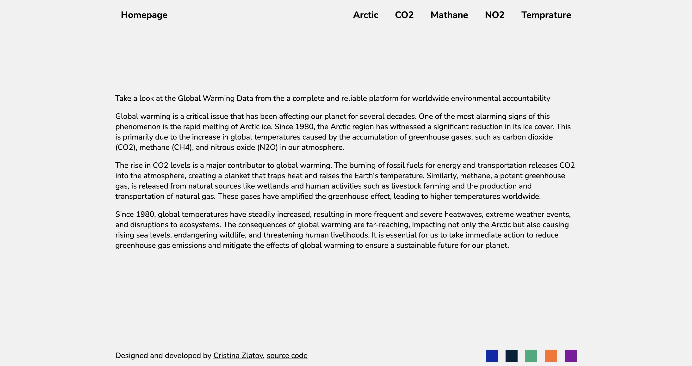
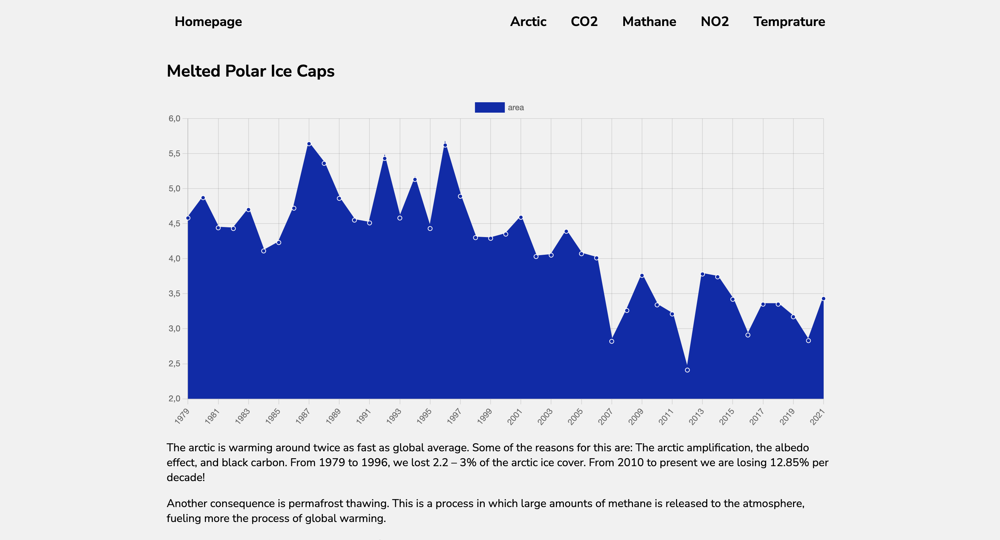

# Global Warming Charts

Dashboard to showcase data related to global warming: Arctic snow cover, CO2, NO2, Methane, Rising temperatures 

## Requiremets

Dashboard website project with:

Home - Where you can select the chart to view
Temperature - https://global-warming.org/api/temperature-api
CO2 - https://global-warming.org/api/co2-api
Methane - https://global-warming.org/api/methane-api
NO2 - https://global-warming.org/api/nitrous-oxide-api
Polar Ice - https://global-warming.org/api/arctic-api

Additionally, 

- Simple and easy-to-use UI and UX
- Well-organized and understandable app structure
- Responsive design

